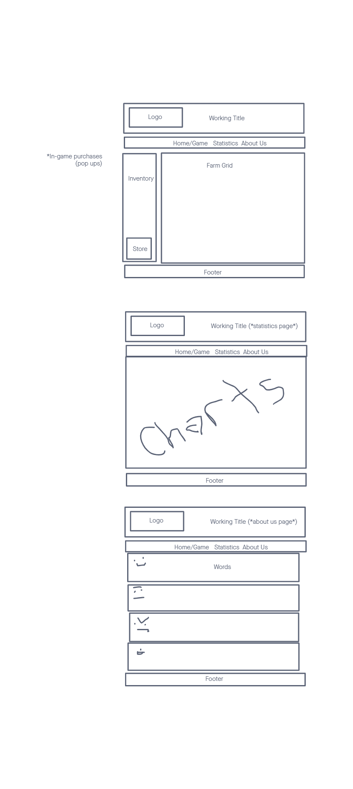
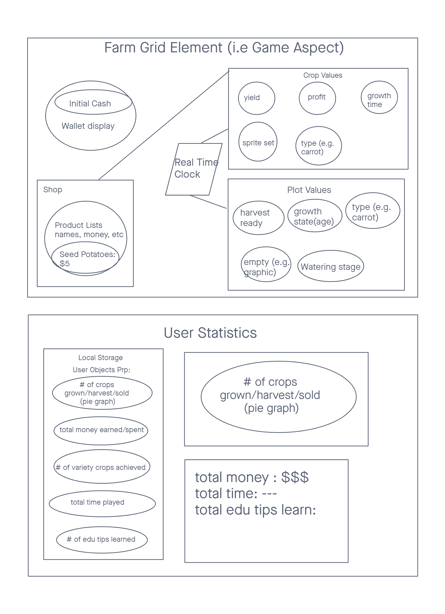

# farming-game

An Educational Farming Game with a 2D grid farm plot that keeps track of your inventory (seeds, plants, tools). Integrates real time clock and you can grow your plants, harvest them, sell them, etc.

## Created by:

- [Jeffrey Jenkins](https://github.com/jeffreyjtech)
- [Liesl White](https://github.com/LieslW)
- [Lauren Murphy](https://github.com/L-nobilis)
- [Michael Maker](https://github.com/guerillaxgardener)

## Wireframe

## Domain Model

## Resources Used

[Stack Overflow](https://stackoverflow.com/questions/28939690/aligning-header-in-css-with-logo-image)
CSS header and image alignment About Us page

[Google Fonts](https://fonts.google.com/specimen/Open+Sans?category=Serif,Sans+Serif#standard-styles)
CSS Font

[MDN: Array.prototype.find()](https://developer.mozilla.org/en-US/docs/Web/JavaScript/Reference/Global_Objects/Array/find)
MDN reference for the .find() array method

## Fun Fact Resources
[Tomato Fun Facts](https://www.campbellsoup.co.uk/blog/fun-facts-about-tomatoes/)

[Carrot Fun Facts](https://www.sciencekids.co.nz/sciencefacts/food/carrots.html)

[Corn Fun Facts](https://www.freshcityfarsm.com/blogs/9-facts-you-might-not-know-about-corn)

[Potato Fun Facts](https://www.foodrepublic.com/2014/12/22/10-thing-you-probably-didnt-know-about-potatoes/)

